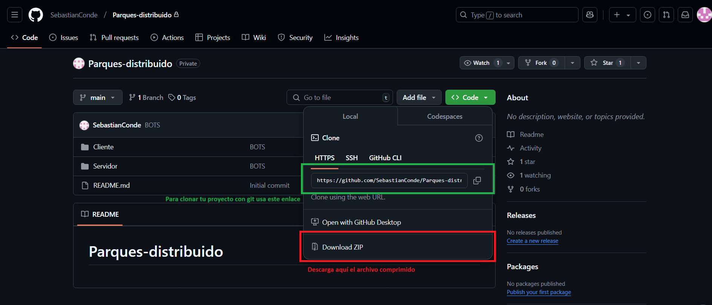
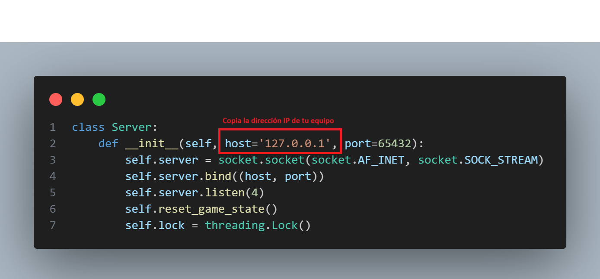

# Parques-distribuido

## Instrucciones de uso

1. Clona el repositorio en tu máquina local o descarga el archivo comprimido del proyecto
  

2. Descarga las dependencias con el comando pip  
``pip install pygame``  
``pip install threading``  
``pip install socket``  
``pip install re``

## Para jugar

### Para jugar de manera distribuida, se debe cambiar la direeción IP del servidor por la del equipo en el que se ejecuta. La misma dirección debe ser utilizada en el cliente
 

1. Muevete a la carpeta del servidor con ``cd Servidor``  

2. Ejecuta el servidor con el comando ``python servidor2.py``  
Nota: El servidor2.py tiene implementados bots, mientras que servidor.py no  

3. Muevete a la carpeta del cliente con ``cd ../Cliente``  

4. Ejecuta cada cliente para jugar con el comando ``python cliente.py``  

5. Después de lanzar los dados, selecciona las fichas que quieres mover  

Nota: Para más información de las reglas del juego, revisa el archivo Parques_distribuido.pdf